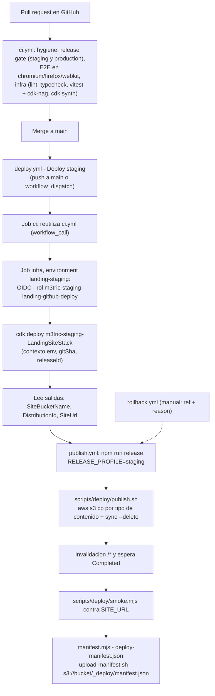

# Manual técnico de operación y publicación

Cómo se construye, valida, publica, verifica y revierte la landing de M3TRIC. Describe el pipeline **real** del repositorio (GitHub Actions + AWS CDK + S3 privado + CloudFront). Cada dato proviene de los archivos citados; si un archivo cambia, este manual debe actualizarse con él.

Documentos relacionados: `docs/SPEC.md` (§9–§12), `infra/README.md` (detalle de los stacks), `docs/TRACEABILITY.md` (estado de cada requisito), `docs/adr/` (decisiones).

---

## 1. Alcance y estado

| Elemento | Valor | Fuente |
|---|---|---|
| Cuenta / región | `147997127433` · `us-east-2` (CloudFront es global) | `infra/config/staging.json` |
| Entorno publicado | `staging` (URL provisional `*.cloudfront.net`, no indexable) | ADR-004 |
| Stack de identidad | `m3tric-staging-LandingDeliveryIdentityStack` — **ya desplegado** por una persona | `infra/README.md` |
| Rol de despliegue | `arn:aws:iam::147997127433:role/m3tric/delivery/m3tric-staging-landing-github-deploy` | `infra/lib/names.ts` |
| Stack del sitio | `m3tric-staging-LandingSiteStack` — lo despliega el workflow `Deploy staging` | `.github/workflows/deploy.yml` |
| Node | `24.19.0` | `.github/workflows/ci.yml`, `infra/package.json` (`engines`) |

El estado de cada requisito (qué está verificado y qué no) está en `docs/TRACEABILITY.md`. Este manual no certifica que la publicación esté operativa: eso lo demuestran el run de GitHub y `_deploy/manifest.json` (sección 8).

## 2. Arquitectura del pipeline



Puntos clave:

- **CI no usa credenciales de AWS**; corre igual en forks. En `main` no hay una corrida de CI aparte: `deploy.yml` llama a `ci.yml` y solo despliega si pasa.
- **Una sola operación a la vez**: `deploy.yml` y `rollback.yml` comparten el grupo de concurrencia `landing-staging` y no cancelan una corrida en curso.
- El build del sitio se hace **antes** de tomar las credenciales de AWS en `publish.yml`.
- El rollback no toca la infraestructura: reconstruye un commit anterior y pasa por el mismo `publish.yml` (ADR-007).
- Todas las *actions* están fijadas por SHA de 40 caracteres (ver sección 15, «Inventario de actions»).

## 3. Perfiles y variables de configuración

El perfil de release decide qué es obligatorio (ADR-003). Las variables `NEXT_PUBLIC_*` se incrustan en el HTML en el build; **no son secretas**.

| Variable | `production` | `staging` | Validación (`scripts/lib/release-config.mjs`) |
|---|---|---|---|
| `RELEASE_PROFILE` | obligatoria | obligatoria | `staging` o `production` |
| `NEXT_PUBLIC_RELEASE_PROFILE` | obligatoria | obligatoria | debe ser igual a `RELEASE_PROFILE`; controla `noindex` y el bloque de contacto |
| `NEXT_PUBLIC_RELEASE_ID` | opcional | opcional | `^[A-Za-z0-9._-]{1,64}$`; vacío = `local`; aparece en el meta `m3tric:release` |
| `NEXT_PUBLIC_SITE_URL` | obligatoria | obligatoria | origen `https` puro (sin ruta, query, hash ni barra final), dominio público |
| `NEXT_PUBLIC_PLATFORM_URL` | obligatoria | obligatoria | `https`, sin usuario/contraseña, dominio público |
| `NEXT_PUBLIC_CONTACT_EMAIL` | obligatoria | opcional | expresión estricta; sin dominios de ejemplo o prueba. Si está presente se valida siempre |
| `NEXT_PUBLIC_CONTACT_PHONE` | opcional | opcional | formato E.164 (`+573001234567`) |

No se aceptan IP literales, hosts de una sola etiqueta, punto final, ni `.local`, `.internal`, `.test`, `.example`, `.invalid`, `localhost` o `example.{com,org,net}`.

Valores de staging en GitHub (variables del environment, ver sección 5): `PLATFORM_URL = https://d3pz2gipvkcx1b.cloudfront.net/login` (plataforma staging vigente, `docs/SPEC.md` §9). `SITE_URL` no se configura: el workflow lo lee de la salida `SiteUrl` del stack en cada deploy.

## 4. Bootstrap único: stack de identidad

Se hace **una sola vez**, por una persona con credenciales locales de administración (perfil `flypark`), nunca desde el workflow (ADR-002). **Ya está desplegado**; esta sección documenta cómo se hizo y cómo repetirlo si hubiera que recrearlo.

Requisitos: bootstrap de CDK existente en la cuenta (qualifier `hnb659fds`, versión 31; la plantilla exige ≥ 6) y el proveedor OIDC `token.actions.githubusercontent.com` ya creado en la cuenta (el stack lo **importa**, no lo crea).

```bash
cd infra && npm ci && npm test
AWS_PROFILE=flypark npx cdk diff m3tric-staging-LandingDeliveryIdentityStack \
  -c env=staging -c gitSha=$(git rev-parse HEAD) -c releaseId=identity-$(date +%Y%m%d)

AWS_PROFILE=flypark npx cdk deploy m3tric-staging-LandingDeliveryIdentityStack \
  -c env=staging -c gitSha=$(git rev-parse HEAD) -c releaseId=identity-<YYYYMMDD>
```

CDK pedirá confirmar los cambios de IAM: revisarlos contra `docs/SPEC.md` §10.1 antes de aceptar. La salida `RoleArn` es el valor de la variable `AWS_DEPLOY_ROLE_ARN` (sección 5).

El stack tiene protección de terminación. Orden de retiro: primero el stack del sitio, después el de identidad (desactivar antes su protección). Al revés, IAM rechaza borrar un rol con una política en línea de otro stack.

## 5. Environment de GitHub `landing-staging`

Configuración en el repositorio `Alexic12/m3tric-landing` → *Settings → Environments → `landing-staging`*:

| Ajuste | Valor |
|---|---|
| Política de ramas | solo `main` (el `sub` del OIDC incluye el nombre del environment) |
| Variable `AWS_DEPLOY_ROLE_ARN` | `arn:aws:iam::147997127433:role/m3tric/delivery/m3tric-staging-landing-github-deploy` |
| Variable `AWS_REGION` | `us-east-2` |
| Variable `PLATFORM_URL` | URL del login de la plataforma de staging (ver sección 3) |
| Variable opcional `CONTACT_EMAIL` | correo aprobado; si está vacía, el sitio muestra «Los canales de contacto se publicarán con el dominio oficial.» |
| Variable opcional `CONTACT_PHONE` | teléfono E.164 |

Todas son **variables**, no secretos: ningún valor es sensible y el repositorio es público. No existen llaves de acceso de AWS en ninguna parte (solo OIDC).

El workflow depende de que el environment se llame exactamente `landing-staging`: la confianza del rol exige `sub = repo:Alexic12/m3tric-landing:environment:landing-staging` y `aud = sts.amazonaws.com`.

## 6. Cómo desplegar

**Opción A — fusionar a `main`** (camino normal): abrir un PR → CI debe pasar → fusionar. El `push` a `main` ejecuta `Deploy staging` automáticamente.

**Opción B — manual**: *Actions → Deploy staging → Run workflow*, rama `main`, con el campo obligatorio `reason` (motivo; queda en el resumen del job).

Qué hace el workflow (`.github/workflows/deploy.yml` y `publish.yml`):

1. Job `ci`: `ci.yml` completo.
2. Job `infra` (environment `landing-staging`): identificador de release `deploy-<run_number>-<sha7>`; asume el rol por OIDC; `npx cdk deploy m3tric-staging-LandingSiteStack -c env=staging -c gitSha=$GITHUB_SHA -c releaseId=<release_id> --require-approval never`; lee las salidas del stack (`SiteBucketName`, `DistributionId`, `SiteUrl`; rechaza una `SiteUrl` que no sea `https`).
3. Job `publish` (`publish.yml`, también en el environment): comprueba que el commit tenga `publish.sh`, `smoke.mjs`, `manifest.mjs` y `upload-manifest.sh`; `npm ci`; `npm run release` con `RELEASE_PROFILE=staging`; asume el rol; `publish.sh`; `smoke.mjs`; `manifest.mjs`; `upload-manifest.sh`; sube el artefacto `deploy-manifest-<release_id>` (90 días) y escribe el resumen del job.

El **primer** despliegue del stack tarda varios minutos por la creación de la distribución. El manifiesto se registra aunque el smoke falle (la versión queda publicada en ambos casos y el manifiesto dice si pasó).

## 7. Cómo hacer rollback

*Actions → Rollback staging → Run workflow* (`rollback.yml`):

| Entrada | Descripción |
|---|---|
| `ref` | SHA o *tag* a publicar. Solo `[A-Za-z0-9._/-]`, máximo 100 caracteres, empezando por letra o dígito. Debe estar en el historial de `main` y contener `scripts/deploy/publish.sh` |
| `reason` | Motivo (obligatorio; queda en el resumen) |

El workflow valida la referencia, lee las salidas del stack y ejecuta `publish.yml` con el identificador `rollback-<run_id>-<sha7>`: reconstruye ese commit con el perfil staging, lo publica, invalida, ejecuta el smoke y registra el manifiesto. No toca la infraestructura (ADR-007).

Después de un rollback, verifique con la sección 8: `releaseId` del manifiesto debe empezar por `rollback-` y `commit` debe ser el solicitado. La prueba de rollback exigida por REQ-A12 se registra en `docs/TRACEABILITY.md`.

Los *deploys* fallidos del stack se revierten solos (rollback de CloudFormation).

## 8. Cómo verificar

### 8.1 Smoke automático (`scripts/deploy/smoke.mjs`)

Se ejecuta en cada publicación contra `SITE_URL`. Reintenta con espera creciente (2 s hasta 15 s; plazo de 120 s, configurable con `SMOKE_DEADLINE_MS`) porque la invalidación y la propagación son eventualmente consistentes. Escribe `smoke-result.json` y falla el job si algún *check* no pasa.

| # | Check | Qué comprueba |
|---|---|---|
| 1 | `GET / -> 200 HTML` | Estado 200 y `content-type` HTML |
| 2 | `Release profile and release id (meta + robots.txt)` | Meta robots y `robots.txt` coherentes con el perfil (staging: `noindex, nofollow`, `Disallow: /` y sin `Sitemap`); meta `m3tric:release` igual al `ReleaseId` esperado |
| 3 | `Security headers on /` | CSP (`default-src 'self'`, `frame-ancestors 'none'`, `object-src 'none'`), HSTS `max-age=63072000`, `nosniff`, `X-Frame-Options: DENY`, `Referrer-Policy`, `Permissions-Policy` con `camera=()`, y `X-Robots-Tag` con `noindex`/`nofollow` en staging |
| 4 | `/ revalidates (Cache-Control no-cache)` | `Cache-Control` de `/` contiene `no-cache` |
| 5 | `Unknown path -> 404 with the site's own page` | `/no-existe-<t>` devuelve 404 con el mismo cuerpo que `/404.html` |
| 6 | `A _next/static asset is immutable` | Un JS de `_next/static` responde 200 con `max-age=31536000` e `immutable` |
| 7 | `og.png, sitemap.xml, manifest.webmanifest` | `og.png` 200 `image/png` con `max-age=86400`; `sitemap.xml` 200 y contiene `SITE_URL`; manifest 200 `application/manifest+json` |
| 8 | `robots.txt -> 200 text/plain` | Estado y tipo |
| 9 | `Every "Abrir plataforma" link equals PLATFORM_URL` | Todos los enlaces con ese texto apuntan a `PLATFORM_URL` |
| 10 | `Direct S3 GET -> 403 (bucket is private)` | `GET https://<bucket>.s3.<región>.amazonaws.com/index.html` responde 403. Si `BUCKET_NAME` o `AWS_REGION` no están definidos, se reporta `skipped` (nunca como aprobado) |

Para ejecutarlo a mano contra una URL:

```bash
SITE_URL=https://<dominio>.cloudfront.net \
PLATFORM_URL=https://<url-del-login> \
EXPECT_PROFILE=staging \
EXPECT_RELEASE_ID=<release-id> \
node scripts/deploy/smoke.mjs
```

### 8.2 Qué versión está viva: `/_deploy/manifest.json`

```bash
curl -s https://<dominio>.cloudfront.net/_deploy/manifest.json
```

Campos: `commit`, `releaseId`, `runId`, `runUrl`, `siteUrl`, `stack` (`name`, `bucket`, `distributionId`), `profile`, `builtAt`, `files` (ruta, `sha256` y bytes de cada archivo de `out/`) y `smoke` (resultado completo). Se sube con `Cache-Control: no-cache`. El mismo archivo queda como artefacto del run (`deploy-manifest-<release_id>`, 90 días).

### 8.3 Verificación manual rápida

```bash
curl -I https://<dominio>.cloudfront.net/                 # 200, cabeceras de seguridad, cache-control: no-cache
curl -I https://<dominio>.cloudfront.net/no-existe        # 404 (página propia), no 403
curl -I https://<dominio>.cloudfront.net/robots.txt       # staging: Disallow: /
```

## 9. Estrategia de caché (`scripts/deploy/publish.sh`)

`publish.sh <bucket> <distribution-id>` publica `out/` en siete pasos. Usa `aws s3 cp --recursive` para los pasos por tipo (siempre sube, así cada objeto lleva exactamente las cabeceras de abajo, sin importar su fecha de modificación) y `aws s3 sync` solo para borrar. Orden: activos con hash primero, HTML al final, para que ningún visitante reciba una página cuyos activos aún no existen.

| Paso | Contenido | `Cache-Control` | `Content-Type` |
|---|---|---|---|
| 1/7 | `_next/static/*.woff2` | `public, max-age=31536000, immutable` | `font/woff2` |
| 1/7 | resto de `_next/static/*` | `public, max-age=31536000, immutable` | el que infiere la CLI |
| 2/7 | `images/*`, `og.png`, `icon.svg`, `apple-icon.png`, `icon-192.png`, `icon-512.png` | `public, max-age=86400` | el que infiere la CLI |
| 3/7 | `*.webmanifest` | `no-cache` | `application/manifest+json` |
| 4/7 | `*.txt` (robots y cargas RSC) | `no-cache` | `text/plain; charset=utf-8` |
| 5/7 | todo lo demás no listado | `no-cache` (valor seguro por defecto) | el que infiere la CLI |
| 6/7 | `*.html` (al final) | `no-cache` | `text/html; charset=utf-8` |
| 6/7 | `sync --delete --size-only`, excluye `_deploy/*` | `no-cache` | — |
| 7/7 | Invalidación `/*` y `aws cloudfront wait invalidation-completed` | — | — |

El `sync --delete` elimina claves obsoletas; como cada clave de `out/` se acaba de subir con el mismo tamaño, **no debe subir nada**. Si sube algo, el script falla («the delete pass uploaded files, so a typed pass missed them») porque habría sobrescrito cabeceras. `_deploy/*` (el manifiesto) nunca se borra.

La distribución usa la política `CachingOptimized`, que respeta el `Cache-Control` de origen que fija este script.

## 10. Cabeceras de seguridad (CloudFront `ResponseHeadersPolicy`)

Las define `infra/lib/landing-site-stack.ts` (política `m3tric-staging-landing-security-headers`, todas con `override`), no el sitio estático:

```
Content-Security-Policy: default-src 'self'; script-src 'self' 'unsafe-inline'; style-src 'self' 'unsafe-inline'; img-src 'self' data:; font-src 'self'; connect-src 'self'; frame-ancestors 'none'; base-uri 'self'; form-action 'self'; object-src 'none'
Strict-Transport-Security: max-age=63072000; includeSubDomains
X-Content-Type-Options: nosniff
X-Frame-Options: DENY
Referrer-Policy: strict-origin-when-cross-origin
Permissions-Policy: camera=(), microphone=(), geolocation=(), payment=(), usb=()
X-Robots-Tag: noindex, nofollow        # solo mientras robotsNoindex sea true (staging)
```

`'unsafe-inline'` en `script-src` y `style-src` es necesario porque la exportación estática de Next.js incrusta sus scripts y estilos de arranque; es un riesgo aceptado y documentado. Las pruebas `site.test › «sends the exact SPEC §10.2 security headers…»` fijan estos valores literalmente.

Otros ajustes de la distribución: origen S3 con OAC (sin OAI), `index.html` como raíz, HTTP/2 y HTTP/3, `redirect-to-https`, `PriceClass_100`, compresión, solo `GET`/`HEAD`; errores 403 y 404 se resuelven como 404 con `/404.html` (TTL de error de 60 s); logs estándar en `LogsBucket/cloudfront/`.

## 11. Build y pruebas locales

```bash
npm ci
cp .env.example .env.production.local        # y completar según el perfil
npm run check:config                          # solo valida las variables
npm run release                               # pipeline completo, fail-closed
npm run serve:out                             # http://localhost:4173
```

Ejemplo de release local con perfil staging:

```bash
RELEASE_PROFILE=staging NEXT_PUBLIC_RELEASE_PROFILE=staging \
NEXT_PUBLIC_SITE_URL=https://d111111abcdef8.cloudfront.net \
NEXT_PUBLIC_PLATFORM_URL=https://app.m3tric-test.co/login \
npm run release
```

`npm run release` ejecuta en orden: `test:unit` → `check:config` → `lint` → `typecheck` → `next build` → `check:artifact`. Si un paso falla, se detiene con código 1.

`check:artifact` (`scripts/check-artifact.mjs`) verifica sobre `out/`:

- archivos requeridos: `index.html`, `404.html`, `robots.txt`, `sitemap.xml`, `manifest.webmanifest`, `og.png`, `icon.svg`, `apple-icon.png`, `icon-192.png`, `icon-512.png`;
- texto prohibido (`localhost`, `127.0.0.1`, `0.0.0.0`, `[::1]`, `example.com`, `TODO`, `lorem`, `placeholder`) en HTML, TXT, XML, JSON, SVG y manifest; en JS/CSS solo URLs de desarrollo;
- que `sitemap.xml` (y `robots.txt` en producción) contengan `SITE_URL`;
- que `index.html` enlace la `PLATFORM_URL` exacta, el `mailto:` exacto si hay correo, y contenga el JSON-LD `FAQPage`;
- coherencia del perfil: staging con `noindex, nofollow`, `Disallow: /` y sin `Sitemap`; producción sin nada de eso; `m3tric:release` igual a `NEXT_PUBLIC_RELEASE_ID` si está definido;
- que `index.html` referencie `/og.png` y que cada imagen de `/images` referenciada exista.

Otras pruebas:

| Comando | Qué hace |
|---|---|
| `npm run test:unit` | Pruebas `node --test` de las reglas de configuración, reglas de artefacto, higiene y manifiesto |
| `npm run hygiene` | Acciones fijadas por SHA, archivos prohibidos (`.env*` salvo `.env.example`, `*.pem`, `*.key`, `cdk.out`, `node_modules`, `out`, `.next`) y marcadores de conflicto |
| `npm run test:e2e` | Build con perfil production y dominios de verificación, suite Playwright (chromium, firefox, webkit, chrome) y conversión de capturas |
| `npm run test:e2e:ci` | Lo mismo en chromium, firefox y webkit sin comparar snapshots (ADR-006) |
| `npm run test:e2e:update` | Regenera los snapshots de regresión visual (solo chromium) |
| `npm run evidence:lighthouse` | Lighthouse móvil y escritorio → `docs/evidence/` |
| `npm run evidence:contrast` | Contraste medido sobre fotografía → `docs/evidence/contrast-hero.md` |
| `cd infra && npm test` | Plantillas exactas + `cdk-nag` (supresiones revisadas una a una) |

El LCP local no es el criterio de aceptación: se mide en CloudFront (ADR-005).

## 12. Costos

Estimación (no medición) de `infra/README.md`, con tráfico de landing:

| Concepto | Mensual |
|---|---|
| S3 (< 50 MB con versiones) | < USD 0,05 |
| CloudFront (capa gratuita permanente) | ≈ USD 0 |
| Invalidaciones (`/*` cuenta como 1 ruta) | USD 0 |
| Logs (90 días) | < USD 0,05 |
| AWS Budgets, SNS | USD 0 |
| **Total** | **< USD 2** (probablemente < USD 1) |

Presupuesto `m3tric-staging-landing-monthly`: USD 10/mes, filtrado por la etiqueta `Component=landing`, con aviso cuando el gasto **real** supera el 80 %, hacia el tema SNS `m3tric-staging-landing-budget-alerts` (sin suscripción: destinatario pendiente del cliente). Para que el presupuesto cuente gasto, la etiqueta `Component` debe activarse como etiqueta de asignación de costos:

```bash
aws ce update-cost-allocation-tags-status --cost-allocation-tags-status TagKey=Component,Status=Active
```

(la etiqueta aparece hasta 24 h después de crear el primer recurso etiquetado; la activación no es retroactiva). Para suscribir un correo:

```bash
aws sns subscribe --topic-arn arn:aws:sns:us-east-2:147997127433:m3tric-staging-landing-budget-alerts \
  --protocol email --notification-endpoint <correo>
```

## 13. Resolución de problemas

| Síntoma | Causa probable | Qué hacer |
|---|---|---|
| `Not authorized to perform sts:AssumeRoleWithWebIdentity` | La confianza del rol exige `aud = sts.amazonaws.com` y `sub = repo:Alexic12/m3tric-landing:environment:landing-staging` | Verifique que el job declara `environment: landing-staging` (nombre exacto); que corre desde `main` (la política de ramas del environment); que el repositorio y el propietario son `Alexic12/m3tric-landing`; que `AWS_DEPLOY_ROLE_ARN` es el ARN correcto y que el job tiene `id-token: write`. Si el repositorio activó el formato de `sub` inmutable, hay que actualizar `githubOidcSubject` y redesplegar la identidad |
| `cdk deploy` falla por versión de bootstrap | La plantilla exige bootstrap ≥ 6; la cuenta tiene la versión 31 (`app.test › «requires a CDK bootstrap version the account has (31)»`) | Compruebe `/cdk-bootstrap/hnb659fds/version` en SSM de `us-east-2`; no cambie el qualifier |
| `cdk deploy` falla al adjuntar la política de publicación | El stack de identidad no existe: la política se adjunta por nombre al rol | Despliegue primero `m3tric-staging-LandingDeliveryIdentityStack` (sección 4) |
| La publicación «tarda» tras `publish: 7/7` | `aws cloudfront wait invalidation-completed` espera el estado `Completed` (minutos) | Esperar. Si excede el tiempo del job (30 min), reejecutar el workflow |
| Smoke: falla un check pero la versión ya está publicada | La versión queda viva aunque el smoke falle; `deploy-manifest.json` registra `smoke.passed: false` | Lea el detalle del check en el resumen del job; corrija y vuelva a desplegar, o ejecute el rollback (sección 7) |
| Smoke: check 10 en `skipped` | `BUCKET_NAME` o `AWS_REGION` no definidos | No cuenta como aprobado; verifique el GET directo al bucket a mano (debe ser 403) |
| `publish: the delete pass uploaded files` | Un archivo de `out/` no coincide con ningún filtro de los pasos por tipo | Ajuste los filtros de `scripts/deploy/publish.sh`; no se publica nada incorrecto |
| `curl -I` muestra `X-Robots-Tag: noindex, nofollow` | **Esperado** en staging (ADR-004) | Nada. En producción esa cabecera no debe existir |
| `403` al abrir una URL inexistente | CloudFront mapea 403 y 404 de S3 a la página 404 propia con estado 404 | Si ve 403 real, revise la política del bucket (solo el servicio CloudFront con `AWS:SourceArn` de la distribución) |
| `check:config FALLÓ` | Variable ausente o inválida para el perfil | Lea el mensaje: indica la variable y la regla incumplida |
| `hygiene: action not pinned to a 40-hex SHA` | Una *action* usa una etiqueta (`@v4`) | Fije el SHA de 40 caracteres y deje la versión como comentario |
| Rollback: `ref does not resolve to a commit` / `is not in main's history` / `predates the deploy pipeline` | La referencia no es válida o es anterior al pipeline | Use un SHA de `main` posterior a la incorporación de `scripts/deploy/publish.sh` |
| Presupuesto en USD 0 | La etiqueta `Component` no está activada como etiqueta de asignación de costos | Sección 12 |

## 14. Promoción a producción

Hoy el repositorio solo tiene configuración y workflows de **staging** (`infra/config/staging.json`; no existe `production.json`: `infra-config.test › «fails with a clear message when an environment has no configuration file»`; los workflows fijan `m3tric-staging-*` y `EXPECT_PROFILE: staging`). Pasar a producción requiere, en este orden:

1. **Insumos del cliente** (`docs/SPEC.md` §16): dominio productivo; URL oficial del login; correo (y teléfono) de contacto aprobados; destinatario de la alerta presupuestal.
2. **Dominio y TLS**: certificado ACM en `us-east-1`, zona y registros en Route 53 (apex y `www`), y alias en la distribución. Esto exige **cambios en `infra/`** (certificado, nombres de dominio, política mínima de TLS 1.2+ y retirar la supresión `AwsSolutions-CFR4`). No están implementados.
3. **Configuración**: `infra/config/production.json` con `environment: "production"` y `robotsNoindex: false`.
4. **Perfil de release**: `RELEASE_PROFILE=production` y `NEXT_PUBLIC_RELEASE_PROFILE=production`, `NEXT_PUBLIC_SITE_URL` = dominio oficial, `NEXT_PUBLIC_PLATFORM_URL` oficial y **`NEXT_PUBLIC_CONTACT_EMAIL` obligatorio** (el gate falla sin él). En producción el sitio es indexable y `robots.txt` anuncia el sitemap.
5. **Workflows y environment propios**: parametrizar `deploy.yml`/`publish.yml` (hoy fijos a staging), crear un environment (`landing-production`) con **revisores obligatorios** y un rol de identidad propio con su `sub` exacto.
6. **Endurecer antes de abrir producción** (ADR-002): bootstrap con política de ejecución de CloudFormation acotada en lugar de `AdministratorAccess`.
7. **Verificación**: smoke con `EXPECT_PROFILE=production` (sin `X-Robots-Tag`), Lighthouse y E2E contra el dominio, y smoke manual en Safari real y Edge (`docs/evidence/browser-matrix.md`).

## 15. Referencias

### Inventario de actions (todas fijadas por SHA)

| Action | Versión | SHA (40) | Workflows |
|---|---|---|---|
| `actions/checkout` | v7.0.1 | `3d3c42e5aac5ba805825da76410c181273ba90b1` | `ci`, `deploy`, `publish`, `rollback` |
| `actions/setup-node` | v7.0.0 | `820762786026740c76f36085b0efc47a31fe5020` | `ci`, `deploy`, `publish` |
| `actions/upload-artifact` | v7.0.1 | `043fb46d1a93c77aae656e7c1c64a875d1fc6a0a` | `ci`, `publish` |
| `aws-actions/configure-aws-credentials` | v6.3.0 | `e1253824e5c10ff9df46874f81ed3ec929e19cfd` | `deploy`, `publish`, `rollback` |

### Documentos

- `docs/SPEC.md` §9 (perfiles), §10 (IaC), §11 (CI/CD), §12 (seguridad).
- `infra/README.md` (stacks, supresiones de `cdk-nag`, riesgos aceptados, retiro).
- `docs/adr/ADR-002`, `ADR-003`, `ADR-004`, `ADR-005`, `ADR-006`, `ADR-007`.
- `docs/TRACEABILITY.md` (estado de los requisitos y brechas).
- AWS CLI: [s3 cp](https://docs.aws.amazon.com/cli/latest/reference/s3/cp.html), [s3 sync](https://docs.aws.amazon.com/cli/latest/reference/s3/sync.html), [cloudfront create-invalidation](https://docs.aws.amazon.com/cli/latest/reference/cloudfront/create-invalidation.html).
